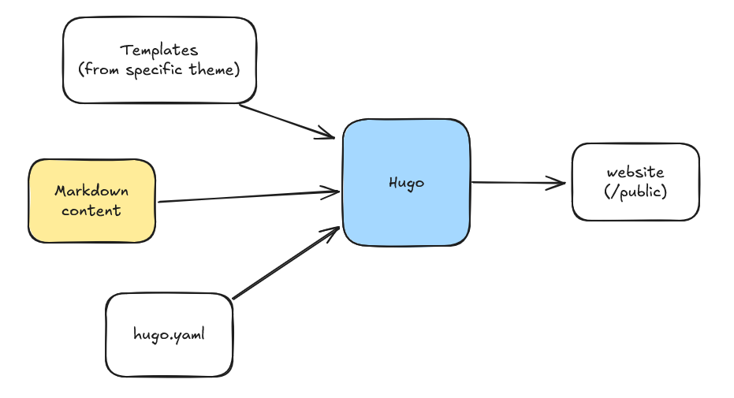

# Installation

## Installing Hugo (MacOS)

- `brew update`
- `brew install hugo`

## Adding Theme

- `git clone https://github.com/adityatelange/hugo-PaperMod themes/PaperMod --depth=1`

Update `hugo.yaml` to include `theme: ['PaperMod']`.

## Adding New Post

- `hugo new content content/posts/my-post-title.md`

## Troubleshooting

- `hugo --cleanDestinationDir`

## Serving Locally

```
hugo server --buildDrafts
```

Use `--buildDrafts` flag to include posts with `draft: true`.

# Latex

\\(
\begin{bmatrix}
   a & b \\
   c & d \\
\end{bmatrix}
\\)

\\(
\Theta
\\)

\\(
\xcancel{ABC}
\\)


# Basics

Hugo is a static site generator written in Go.

{width="350px"}

## Markdown Rendering

Hugo uses `Goldmark` as the Markdown parser.
Files with ending with `.md`, `.mdown`, or `.markdown` are processed as Markdown.

Documentation: https://gohugo.io/configuration/markup/

## HTML Templates

Inside the .html files you will notice a template syntax.
Templates use variables, functions, and methods to transform the markdown content into a published page.

Hugo uses the Go [html/template](https://pkg.go.dev/html/template) and [text/template](https://pkg.go.dev/text/template) packages to handle the templates.

Documentation: https://gohugo.io/templates/introduction/

# Directory Structure

## /hugo.toml

Contains the configuration for the site.

## /public

Contains the generated site ready to be published.

## /content

The content folder contains the content as markup files (markdown) and assets of your site.

## /layouts

Contains the HTML templates for the site.

## /layouts/\_default/baseof.html

The parent template.
The index.html file content.
The start point of the published site.
Contains the base template where the other templates inherit from.

It imports `header.html` and `footer.html` partials.

## /layouts/partials

Contains the HTML for partial content.
For example, you can add `math.html` to handle math equations using some Latex library like KaTeX.

## /layouts/\_default

Contains the default layout for the site.

## /layouts/\_default/\_markup
