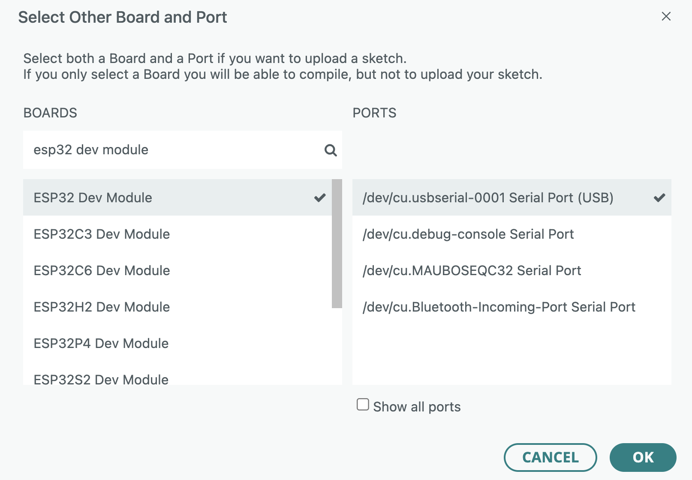
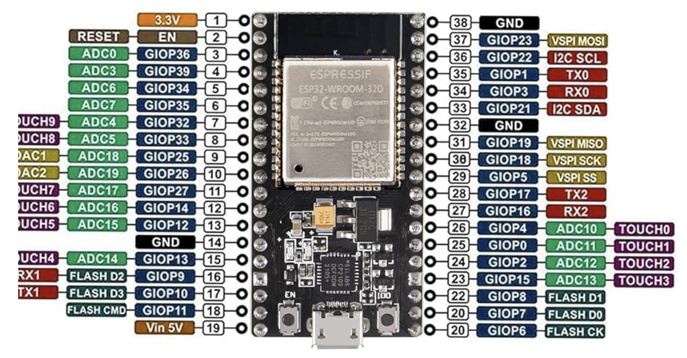

# Hardware

Espressif Systems is the company that makes the ESP32.
The ESP32 is a successor of the ESP8266.

Several brands makes DevKits boards that wrap the microcontroller in a nice package with pins, buttons, USB port, and even built-in LED.

I got the "HiLetgo ESP-32D Development Board" from Amazon for around $10.
The following content is about this specific board setup using macOS.

# Arduino IDE Setup

Install the Arduino IDE.
Then we need to install the ESP32 board.

- Go to Settings > Additional Boards Manager URLs
- Add `http://arduino.esp8266.com/stable/package_esp8266com_index.json`
- Go to Tools > Board > Boards Manager
- Search for `esp32` and install `esp32 by Espressif Systems`

Then we need to select the board and USB port.



# USB driver

It has the CP2102 chip that is a USB-to-UART bridge controller made by Silicon Labs.
It's a small chip that allows the microcontroller to be programmed via USB.
In Windows, we need to install the CP2102 driver.
For Mac, it should work out of the box.

# Testing the board

The Hiletgo board has a built-in LED in `GPIO2`.
We can test the board by blinking the LED.
Below is the code to blink the LED.

```c
void setup() {
  pinMode(2, OUTPUT);  // GPIO2 as output
}

void loop() {
  digitalWrite(2, HIGH);  // Turn LED on
  delay(1000);            // Wait 1 second
  digitalWrite(2, LOW);   // Turn LED off
  delay(1000);            // Wait 1 second
}
```

# Board PINOUT

Here is the pinout of the board from the manufacturer.



This specific board exposes 38 pins.
The built-in LED is on GPIO2.

## Power

The board has a 3.3V regulator that can supply up to ~300mA.
We should not drain too much current from the power pins.
If you need more current to drive a device like a motor, you may need to use a h-bridge, transistor, relay, etc.

## GPIO

The GPIO pins are the pins that can be used as digital input or output.
The HIGH level is 3.3V.
The LOW level is 0V.

## I2C

The I2C is a communication protocol.
It uses 2 pins: `SDA` and `SCL`.
It's a two-wire protocol.
It's a master-slave protocol.
Each slave has a unique address.
Sometimes you need to manually set the address in the firmware of the device.

## SPI

The SPI is another communication protocol.
It uses 4 pins: `MOSI`, `MISO`, `CLK`, and `CS`.
Normally used when you need more data throughput than I2C can provide.
For example transfering image data from the camera to the microcontroller.

## ADC

The Analog to Digital Converter (ADC) pins are the pins that can be used to read analog input.
Each voltage level from 0 to 3.3V is converted to a digital value from 0 to 1023.
The resolution is 10 bits.
The voltage resolution is 3.3V / 1023 = 3.22mV.

## PWM

The Pulse Width Modulation (PWM) pins are the pins that can be used to generate a PWM signal.
You set the duty cycle of the PWM signal.
And the device will output a voltage that is proportional to the duty cycle by turning the digital pin ON and OFF quickly enough to produce an average voltage.