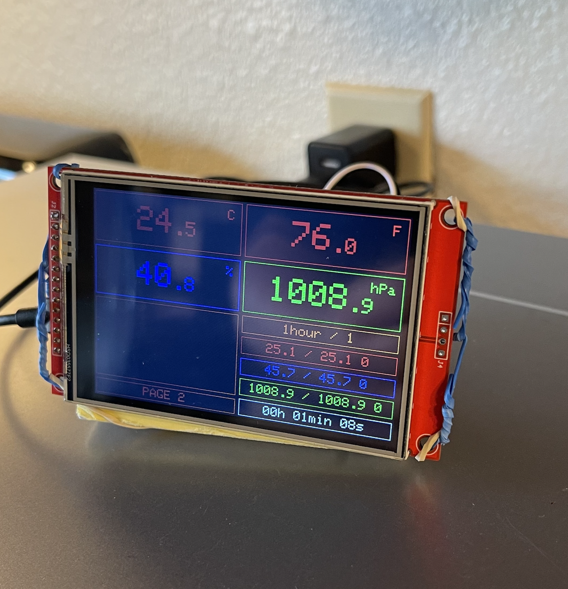
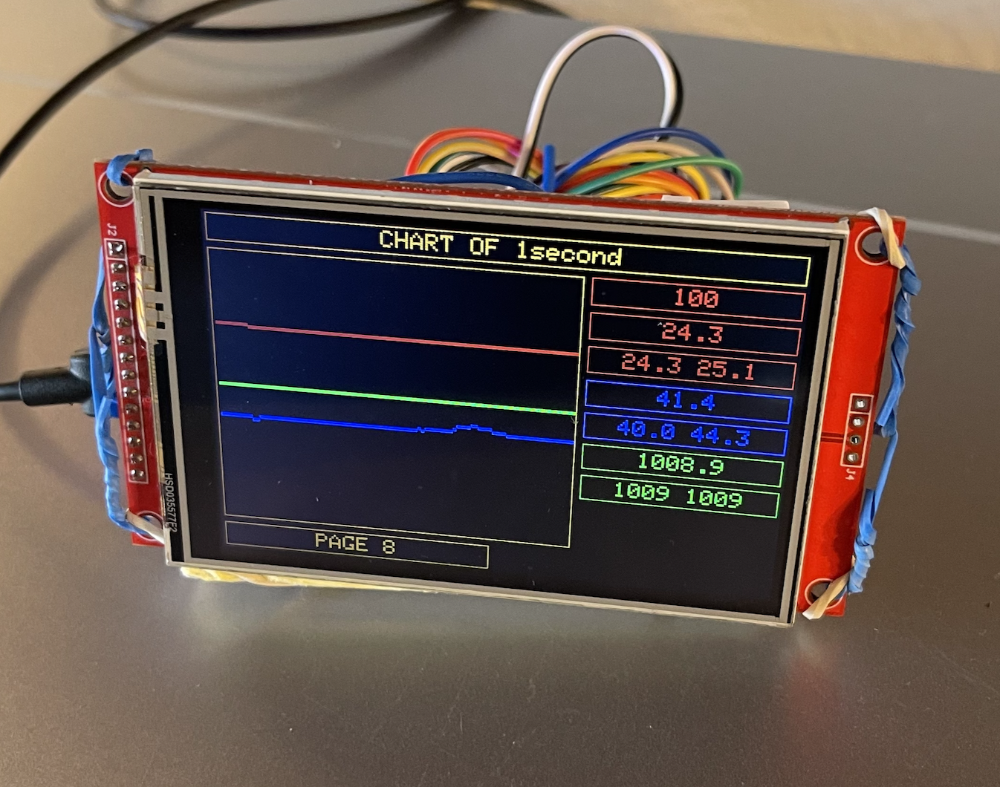

## Introduction

Here I will document the process of building a simple weather station using the `HiLetgo ESP-32D Development Board` and the `BME280` sensor.

## Product Specs

- Be able to measure temperature, humidity, and pressure.
- Be able to keep track of the 100 last samples per second, minute, hour, 3-hour, 8-hour, 24-hour.
- Be able to navigate thru pages using a button.
- Keep min and max value of each metric (temperature, humidity, pressure) for each time period.

## Setup

I got the HiLetgo ESP-32D Development Board from Amazon.
For more info about how to setup the board, see [esp32.md](esp32.md).

### BME280

The BME280 is a sensor that measures temperature, humidity, and pressure.
It uses I2C to communicate with the microcontroller.
The sensor itself is made by [Bosch](https://www.bosch-sensortec.com/products/environmental-sensors/humidity-sensors-bme280/).
But online you can find different modules for the sensor that it easier to integrate with the microcontroller offering PINs and I2C interface.

### Display

To be able to display the data, I got the 4" TFT Display from Amazon.
It's a 480x320 pixel display.
It uses SPI to communicate with the microcontroller.

## Diagram

TBD

## Code

I am using the `Arduino IDE` to program the microcontroller.
We need a few libraries to be able to use the `BME280` sensor and the `TFT Display`.

## Power Supply

I tried using 3 AA batteries in series to power the board (1.5V x 3 = 4.5V total) which is suitable for the voltage regulator of the board.
You can connect the + and - of the battery to the Vin and GND pins of the board.
The Vin pin goes to the voltage regulator of the board.
It is a linear regulator that can handle voltages up to 10V and output 3.3V.
The 5V USB port also goes to the same voltage regulator.

However the capacity of the batteries is not enough to power the board for more than 1 day.
The board is not in sleep mode and it is consuming around 100mA to power the board, sensor and display.
That would require a capacity of around 2400mAh (100mA x 24h = 2.4Ah) from the batteries.
One alternative is to use a 2S lithium battery that can provide more capacity, but I didn't try it yet.

So I decide to use a USB wall adapter to power the board and not have to worry about the batteries.

## Photos

Here we can see the page 2 where we have gauges for temperature in Celsius, temperature in Fahrenheit, humidity, and pressure.
Below we have the chart of the last N samples and the time period of each sample (1 hour).
The number on the right separated by the slack is the number of samples so far.
Below we have the min/max values of each metric for the selected time period.
Last, we have the total amount of time the board has been running since the last reset.

