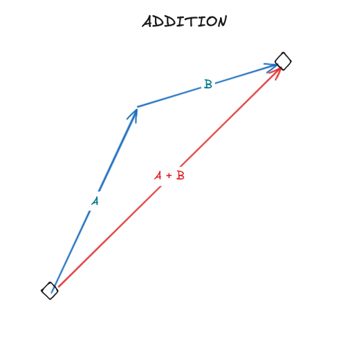
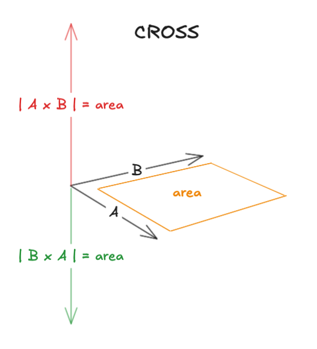

# Definition

In math, a vector is object that has a magnitude and a direction. The components of a vector are the numbers that describe the vector in a coordinate system. A common coordinate system is the Cartesian coordinate system which uses the x, y, and z axes. 

In programming, we can implement a vector as an array of numbers. A 2D vector, for example, can be defined as an array of 2 floats. A 3D vector can be defined as an array of 3 floats.

```
vec2 = [x, y]
```

The `x` and `y` are the components of the vector.

With a vector in hand, we can now perform _operations_ on it. Below are some of the operations that can be performed on a vector.

# Addition & Subtraction

Addition and subtraction of vectors can be done by adding or subtracting the corresponding elements of the vectors.

```
a = [ax, ay]
b = [bx, by]
a + b = [ax + bx, ay + by]
a - b = [ax - bx, ay - by]
```



# Scalar Multiplication

The scalar multiplication of a vector is done by multiplying each component of the vector by the scalar.

```
a = [ax, ay]
scalar = 2
a * scalar = [ax * scalar, ay * scalar]
```

# Dot Product

The dot product of two vectors is a scalar value. It is calculated by multiplying the corresponding elements of the vectors and summing the results.

# Unit Dot Product

Often in computer graphics, we want to do the dot operation between two vectors which one is a unit vector. This operation is useful when we want to project one vector onto another. In other words, how much of a vector is on the axis defined by the unit vector.


# Cross Product

The cross product of two vectors is a vector that is perpendicular to both of the vectors.
And the magnitude of the cross product is the area of the parallelogram formed by the two vectors.



# Magnitude

The magnitude of a vector is the length of the vector. We can calculate the magnitude of a vector using the Pythagorean theorem.

```
magnitude = sqrt(x^2 + y^2)
```

# Unit & Normalized Vector

A unit vector is a vector with a magnitude of 1. We can normalize a vector to get a unit vector.

```
unit_vector = vector / magnitude(vector)
```

# Normal

A normal is a vector that is perpendicular to a surface.
Don't confuse it with the normalized vector.
