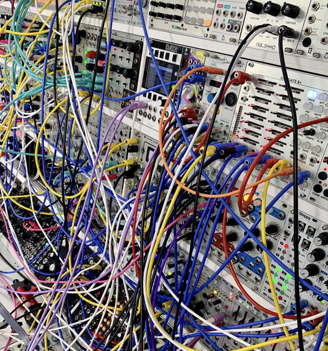

# Web Audio API

Modern web browsers support the Web Audio API, which allows us to create and manipulate audio streams.

## Audio Context

The `AudioContext` object is the main entry point for the Web Audio API.

## Audio Nodes and Chains

The `AudioNode` interface is the base interface for all nodes in the audio processing graph.

We can connect audio nodes together to create a chain of nodes. For example, we can start with the `OscillatorNode` to generate a sine wave, and then connect it to the `GainNode` to control the volume of the sound, and then connect it to the `DestinationNode` to play the sound to the speakers (or any other output device connected to the computer).

It kind remember me those Modular Synthesizers from the old days where you can plug in different modules together to modify the sound.

# Nodes

## Oscillator Node

The `OscillatorNode` allows us to generate a periodic waveform, such as a sine wave, square wave, or triangle wave.

## Gain Node

The `GainNode` allows us to control the volume of the audio stream. The gain property is a scalar value.

## Destination Node

The `DestinationNode` is the final node in the chain and is responsible for playing the audio stream to the speakers.

## Audio Buffer Source Node

The `AudioBufferSourceNode` allows us to create a empty Audio Buffer and populate it with audio data. We can create samples using math functinos like sin or cos to simulate the same behavior of an oscillator node.

## Microphone

The `MediaStreamAudioSourceNode` allows us to access the microphone of the computer. It is part of the Navigator interface, so it is not exactly a node in the Web Audio API. However, we can still connect it to the audio chain as a source node.

# Audio Processing

One great thing about the Web Audio API is that we can process the audio stream in real time. The modern way to do this is to use the `AudioWorklet` interface. The old way is using the `ScriptProcessorNode` interface. 

The problem with the last one is that it runs in the main thread, so it can suffer from performance issues. The `AudioWorklet` interface runs in a separate thread, so it requires a bit more of boilerplate code to set up. Also we need to use message passing to communicate between the main thread and the audio thread.

# MIDI

The MIDI is a protocol that allows us to send and receive MIDI messages. It is a digital protocol that allows us to send and receive MIDI messages between devices. Several devices like keyboards, synthesizers, and controllers can speak MIDI.
